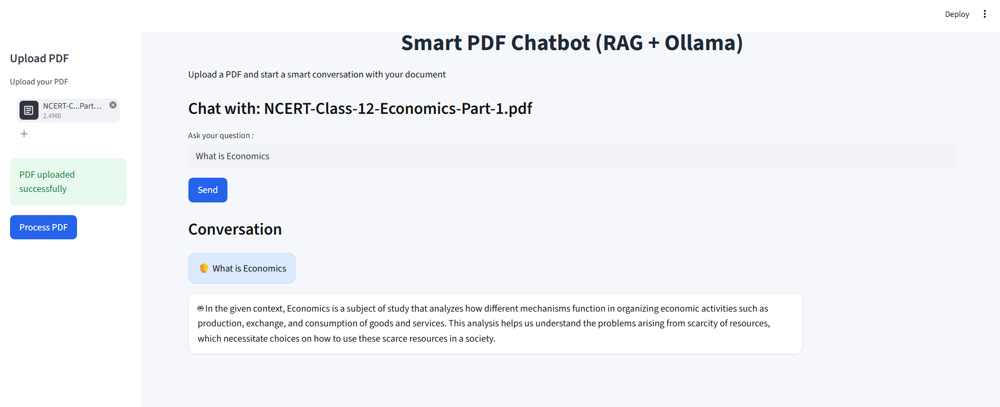
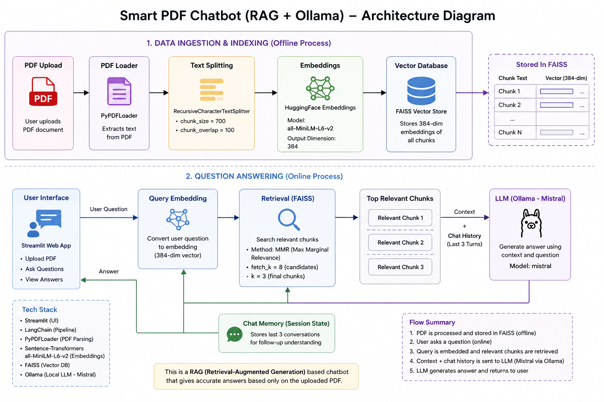

#  Smart PDF Chatbot (RAG + Ollama)

A **Retrieval-Augmented Generation (RAG)** based AI chatbot that allows users to upload any PDF and interact with it in a conversational way.  
Built using **Streamlit, LangChain, FAISS, HuggingFace embeddings, and Ollama (local LLM)**.

---
<p align="center">
  
</p>

---

##  Features

-  Upload any PDF document
-  AI understands document content using embeddings
-  Chat with your PDF like a personal assistant
-  Context-aware answers using FAISS retrieval
-  Supports follow-up questions (memory enabled)
-  Runs locally using Ollama (no API cost)

---

##  Tech Stack

- Streamlit (Frontend UI)
- LangChain (RAG pipeline)
- FAISS (Vector database)
- HuggingFace Transformers (Embeddings)
- SentenceTransformers (all-MiniLM-L6-v2)
- Ollama (Local LLM - Mistral)
- PyPDF (PDF parsing)

---

## System Architecture

The following diagram explains the end-to-end workflow of the Smart PDF Chatbot using RAG and Ollama.



---

##  Setup Guide

### 1️ Clone the repository
```bash
git clone https://github.com/ya-sonia/RAG-based-PDF-chatbot.git
cd RAG-based-PDF-chatbot
```

### 2. Create and activate virtual environment 

```bash
For Windows :
python -m venv venv
venv\Scripts\activate
```

### 3. Install Dependencies
```bash
pip install -r requirements.txt
```

### 4. Install Ollama (IMPORTANT)
Download Ollama:
 https://ollama.com

Then pull the model:
```bash
ollama pull mistral
```

Run Ollama (keep it running in background):
```bash
ollama run mistral
```
### 5. Run the Application
```bash
streamlit run app.py
```
